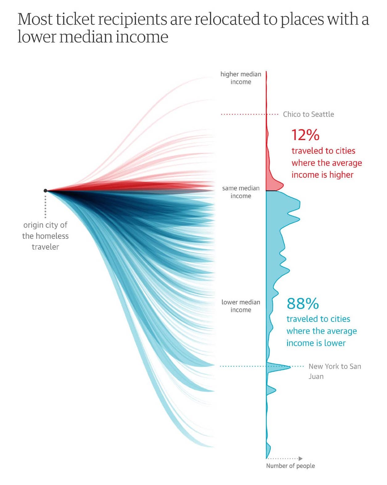

```{r setup, include=FALSE}
library(knitr)
opts_chunk$set(echo = TRUE, warning = FALSE, message = FALSE, fig.align = "center")
```

```{r}
library(tidyverse)
library(lubridate)
theme_set(theme_bw())
```

### Reshaping Practice [3 points]

_The following parts ask you to provide R code that transforms one dataset (I) into another (II)._

_a. Regional murder rates: Turn [I](https://uwmadison.box.com/shared/static/h4gau9heqy3uue9rmpq9b55s3kw37zd8.csv) into [II](https://uwmadison.box.com/shared/static/shy7od3ydtiqu3lmqvy4nbi17qkg2ys4.csv)._

We can use the code below. The main observation is that we need aggregate across
all states within a region, and this is a natural fit for the `group_by` +
`summarise` pattern. The murder rate within a region is defined as the total
number of murders over the total population within that region. Since we don't
have these totals defined in advance, we first compute them using the first two
lines within the `summarise` call. Once those two calls, the new columns are
available to define `murder_rate` in the third line. Finally, we notice that the
example data are sorted in order from lowest to highest murder rates. To ensure
this ordering, we can use `arrange`.

Note that, in general, any transformations defined at the start of a `summarise`
or `mutate` call can be used in subsequent arguments.
    
```{r}
read_csv("https://uwmadison.box.com/shared/static/h4gau9heqy3uue9rmpq9b55s3kw37zd8.csv") %>%
  group_by(region) %>%
  summarise(
    murders = sum(total),
    population = sum(population),
    murder_rate = murders / population
  ) %>%
  arrange(murder_rate)
```


b. Antibiotics and bacteria. Turn [I](https://uwmadison.box.com/shared/static/bq4afq9kl2zn9qlb89q2rxhrrv73iuil.csv) into [II](https://uwmadison.box.com/shared/static/gmzul7bp78o6kwtutl73hkiyxea4dr21.csv)

We can use the code below. Our first observation is that, while the the
different species names are spread out across columns in dataset (I), they are
stacked as different rows in (I). We can reshape the data accordingly using
`pivot_longer()`. The `starts_with("Unc")` selector ensures that every column
that stored a species name (which all start with `"Unc"`) gets merged into a
unified, stacked column.

Our next observation is that the sample names have been split into subject name
and sampling times. There are several ways we could introduce this information
-- e.g., processing the string names within `mutate()` -- but the most concise
approach is to call `separate` with the third argument used to denote the
character position at which to split the sample names. Finally, as in part (b),
we use `arrange()` to sort the rows into the order seen in (II).

```{r}
read_csv("https://uwmadison.box.com/shared/static/bq4afq9kl2zn9qlb89q2rxhrrv73iuil.csv") %>%
  pivot_longer(starts_with("Unc"), names_to = "species") %>%
  separate(sample, c("ind", "time"), 1, convert = TRUE) %>%
  arrange(ind, species, time)
```

  
### City Temperatures [3 points]

_Let's create versions of Figure 2.3 and 2.4 from the [reading](https://clauswilke.com/dataviz/aesthetic-mapping.html) this week. The command below reads in the data. We've filtered to a slightly different set of cities (Barrow is in Alaska, Honolulu is in Hawaii), but we should still be able to study changes in temperature over time._

```{r}
temperature <- read_csv("https://raw.githubusercontent.com/krisrs1128/stat479_s22/main/data/temperatures.csv")
```

_a. Make a version of Figure 2.3 using a line mark (`geom_line`). Make at least one customization of the theme to make the plot more similar to the version in Figure 2.3._ Hint: To group the lines by city, use the `group = ` aesthetic mapping. 

This is a line plot with with the `x`, `y`, and `color` channels encoding time,
temperature, and city, respectively. Hence, we use `geom_line` with the
aesthetic encoding given in `aes()` below. We manually matched the colors using
`scale_color_manual`; we found these HEX color codes using an online image color
picker. By default, the $x$-axis would show the year associated with each date,
but these years are not meaningful in the current data -- the lines are averages
over three years. Therefore, we print only the month name by setting the
`date_labels` argument within  `scale_x_date()`.

```{r, fig.height = 3, fig.width = 5.5, out.width = 600}
temperature <- read_csv("https://raw.githubusercontent.com/krisrs1128/stat479_s22/main/data/temperatures.csv")
ggplot(temperature) +
  geom_line(aes(date, temperature, col = city)) +
  scale_color_manual(values = c("#019e73", "#56b4e9", "#e7a208", "#cc79a7")) +
  scale_x_date(date_labels = "%b") + 
  theme_minimal()
```

_b. Using the `group_by` + `summarise` pattern, compute the mean temperature for each month in each city._

The `group_by` + `summarise` pattern is difficult to directly apply in this
context, because we don't have a month variable to group by! However, if we look
carefully, we can find that the month names are available through the `date`
variable. Therefore, we first derive a month variable with which to use for
grouping, before taking the average of all temperatures within that month.

```{r}
averages <- temperature %>%
  group_by(new_month = month(date, label = TRUE), city) %>%
  summarise(mean_temp = mean(temperature))

head(averages, 4)
```

_c. Using the data generated in (b), Make a version of Figure 2.4 using a tile mark (`geom_tile`). Try either (i) adding the `scale_fill_viridis_c(option = "magma")` scale to match the color scheme from the reading or (ii) adding `coord_fixed()` to make sure the marks are squares, not rectangles._

The `x`, `y`, and `color` channels encode month, city, and average temperature,
respectively, and this is reflected in our `aes()`. We set `col = "white"` to
create a thin white border around each of the squares. We make both changes (i)
and (ii) exactly as discussed in the problem description. Finally, we remove
superfluous tick and grid information using our `theme()` and add meaningful
axes labels through `labs`.

```{r}
ggplot(averages) +
  geom_tile(aes(new_month, city, fill = mean_temp), col = "white", lwd = 0.5) +
  scale_fill_viridis_c(option = "magma") +
  coord_fixed() +
  theme_minimal() + 
  theme(axis.ticks = element_blank(), panel.grid = element_blank()) +
  labs(x = "month", fill = "mean temperature (°F)")
```

_d. Compare and contrast the two displays. What types of comparisons are easier to make / what patterns are most readily visible using Figure 2.3 vs. Figure 2.4, and vice versa?_

The line plot emphasizes change in temperature -- our eyes more easily follow
the rise and fall within the lines, compared to the darkening and lightning in
color used in the heatmap. Differences in temperatures during specific dates are
also more readily apparent, as are queries like "During which seasons is the
temperature within a range of [10, 20] degrees?" Finally, only the line plot
reveals any information at a sub-monthly granularity.


However, though the heatmap does not allow such precise comparisons, it is much
more space efficient. In principle, we could have included many more cities and
still have an interpretable plot. It is also possible to shrink this plot to
take up a smaller space on the page while still maintaining readability, a
potentially important consideration in case we have limited printed / screen
space available within the larger report.

### Soccer Code Review [3 points]

_This exercise asks you to conduct an imaginary code review. These are often used in data science teams to,_

   * _Catch potential bugs_ 
   * _Make sure code is transparent to others_ 
   * _Create a shared knowledge base_  
     
_It is important to be perceptive but friendly._  

  * _Can the code be made more compact?_ 
  * _Are there visual design choices / encodings that could be refined?_ 
  * _If your colleague did something well, say so!_  
   
_They can also be a great way to learn new functions and programming patterns. Unlike standard code-reviews, I ask you to give an example implementing your recommendations._ 
     
_Specifically, in this review, suppose you are working on a sports blog, and your colleague is soccer interested in which teams won the most games in a few European leagues over the last few years. They have written the code below. Provide your code review as a set of bullet points, and include code giving an example implementation of your ideas. The original data are from [this link](https://www.kaggle.com/slehkyi/extended-football-stats-for-european-leagues-xg)._

```{r, fig.cap = "An example figure for code review.", fig.width = 16, fig.height = 4}
win_props <- read_csv("https://raw.githubusercontent.com/krisrs1128/stat479_s22/main/exercises/data/understat_per_game.csv") %>%
  group_by(team, year) %>%
  summarise(n_games = n(), wins = sum(wins) / n_games)

best_teams <- win_props %>%
  ungroup() %>%
  slice_max(wins, prop = 0.2) %>%
  pull(team)

win_props %>%
  filter(team %in% best_teams) %>%
  ggplot() +
  geom_point(aes(year, team, size = n_games, alpha = wins))
```

Though the original code is reasonably consise, the visual design is far from
ideal. The most important limitation is that it is very difficult to distinguish
differences in point size and transparency, meaning that we can't easily answer
which teams are actually the best. Second, the data only occupy a very small
portion of the figure's available space -- there are large gaps between
observations -- and overall, the design poorly uses the available visual real
estate.

We propose two visual alternatives. The first uses a heatmap layout, but shows
the same data. In comparison to transparency, differences in color are easier to
recognize. Moreover, by sorting teams by their average number of wins, we can
more easily navigate the ranking. The use of rectangular heatmap tiles instead
of points also resolves the issue of empty visual space. Note that, in our
implementation below, we manually set the color palette's midpoint to 0.5. Teams
are in different colors depending on whether they win more games than they lose.

```{r, fig.width = 10, fig.height = 6, out.width = "0.9\\textwidth"}
win_props <- filter(win_props, team %in% best_teams)
ggplot(win_props) +
  geom_tile(aes(year, reorder(team, wins), fill = wins, col = wins)) +
  scale_x_continuous(expand = c(0, 0)) +
  scale_y_discrete(expand = c(0, 0)) +
  scale_fill_gradient2(midpoint = 0.5) +
  scale_color_gradient2(midpoint = 0.5) +
  labs(x = "Year", y = "Team")
```

Our second approach gives up on encoding year positionally. This allows us to
present the fraction of wins on the $x$-axis -- arguably a more important
variable of interest. This allows us to make more subtle distinctions in the
fraction of wins than was possible when we were simply using color or
transparency, as in the previous versions of the figure. Note the use of
`scale_size` in the implementation below. This makes the points smaller than
they would have been by default.

```{r, fig.height = 5, fig.width = 12, out.width = "0.9\\textwidth"}
ggplot(win_props) +
  geom_point(aes(wins, reorder(team, wins), size = n_games, col = year)) +
  scale_size(range = c(0, 2)) +
  theme(axis.text = element_text(size = 8))
```

### Visual Redesign [5 points]

### Antibiotics Comparison [3 points]

_Below, we provide three approaches to visualizing species abundance over time in an antibiotics dataset._

```{r}
antibiotic <- read_csv("https://uwmadison.box.com/shared/static/5jmd9pku62291ek20lioevsw1c588ahx.csv")
head(antibiotic, 4)
```

_For each approach, describe,_

  _* One type of visual comparison for which the visualization is well-suited._
  _* One type of visual comparison for which the visualization is poorly-suited._
  
_Make sure to explain your reasoning._

_a. [1.5 points] Approach 1_
```{r, echo = TRUE, out.width = "0.65\\textwidth"}
ggplot(antibiotic, aes(x = time)) +
  geom_line(aes(y = svalue), size = 1.2) +
  geom_point(aes(y = value, col = antibiotic), size = 0.5, alpha = 0.8) +
  facet_grid(species ~ ind, scale = "free_y") +
  scale_color_brewer(palette = "Set2") +
  theme(strip.text.y = element_text(angle = 0))
```

Effective:

  * Comparing abundances over time for each species and subject combination,
  even for rare species. It is easy to compare $y$-axis values within individual
  panels. Since the $y$-axis scales are not shared, trends in even the rare
  species are visible.
  * Comparing species abundance across antibiotic treatment regimes. Since color
  is used to encode treatment regime, we can easily see how peaks or valleys
  coincide with the treatments.

Ineffective:
  
  * Comparing abundances of different species for the same subject. Since the
  $y$-axes scales are not shared, it is hard to compare abundances across
  species.
  * Ranking species by overall abundance within or across subjects. Again, this
  is a consequence of the unshared axis scales.
  * Comparing trends in species abundances across subjects (especially D vs. F).
  Since our eyes have to travel left and right to compare species trends, it is
  harder to evaluate differences across subjects, compared to if they were all
  overlapping, for example.
  
_b. [1.5 points] Approach 2_

```{r, echo = TRUE, out.width = "0.65\\textwidth"}
ggplot(antibiotic) +
  geom_tile(aes(time, ind, fill = value)) +
  scale_x_continuous(expand = c(0, 0)) +
  scale_fill_distiller(direction = 1) +
  facet_grid(species ~ .) +
  theme(strip.text.y = element_text(angle = 0))
```

Effective

  * For individual species, comparing trends over time across subjects. All the
  subjects are placed adjacent to one another within each panel, so our eyes
  don't have to travel such a large distance to make the comparison.
  * Across species, recognizing shared increases or decreases at specific
  timepoints. Since the plot is so compact, all the values for a single
  timepoint are easily queryable.
  * Recognizing the species and samples with the highest abundances. The cells
  with the darkest colors pop out from among the rest.

Ineffective

  * Comparing the absolute abundances of a single species over time. It is
  difficult to compare shades of the same color.
  * Evaluating the abundance of relatively rare species. These species all have
  light colors, and gradations smaller than the color scale bin size are not
  visible.
  * Comparing species abundances for a single subject. We have to move our eyes
  across the three panels to make comparisons about a single species.

_c. [1.5 points] Approach 3_
```{r, echo = FALSE, out.width = "0.65\\textwidth"}
ggplot(antibiotic) +
  geom_line(aes(time, svalue, col = species, group = interaction(species, ind))) +
  facet_grid(ind ~ .) +
  scale_color_brewer(palette = "Set2")
```

Effective

  * Within a single subject, ranking species by overall abundance. We can easily
  see which colors lie above the others within any given panel.
  * Comparing abundance over time for a single subject and species. We can see
  increases and decreases clearly when plotting against a $y$-axis scale.
  * Comparing overall species abundances across subjects. Since the same
  $y$-axis scale is used across panels, we can conclude that some subjects have
  more counts overall.

Ineffective

  * Comparing trends for a single species across subjects. It is visually
  challenging to match colors across the three panels.
  * Comparing trends for low abundance species. For low abundances, many of the
  lines overlap with one another.

_d. [1.5 points] Sketch code that could be used to make one of the three visualizations above._

The code is given in the blocks above.

### Homelessness [3 points]

_Take a static screenshot from any of the visualizations in this [article](https://www.theguardian.com/us-news/ng-interactive/2017/dec/20/bussed-out-america-moves-homeless-people-country-study), and deconstruct its associated visual encodings._

We will analyze this screenshot,
```{r, echo = FALSE, out.width = 300}

```

_a. What do you think was the underlying data behind the current view? What where the rows, and what were the columns?_

The data would have had to include origin-destination city pairs for all the
individuals who were bussed out, the median incomes in each of those cities, and
either (i) the number of people associated with each origin-destination pair or
(ii) a person-level record of trips. These data could have been formed from a
join between two tables: one including all origin-destination counts and another
including city names with their median incomes. In the first of these tables,
the rows would be specific travel routes, the columns might have been `origin`,
`destination` and `count`. In the second table, each row is a city, and the
columns might have been `city` and `median_income`.

_b. What were the data types of each of the columns?_

* `origin`: Categorical
* `destination`: Categorical
* `count`: Numeric (positive integer)
* `median_income`: Numeric (positive real)

_c. What encodings were used? How are properties of marks on the page derived from the underlying abstract data?_

* Edge $x$-positions: Distinguishes between origin and destination of travel.
* Edge and histogram $y$-positions: What is the difference in median income
between the origin and destination city?
* Edge thickness: How many of the records followed that edge's
origin-destination pair?
* Histogram $x$-position: The distance from the base of the histogram describes
how many cities had that particular difference between origin an ddestination
incomes.
* Color: Does the destination city have a higher median income than the source city?

In addition to these purely graphical elements, there is annotation that
describes both how to read the figure ("origin city of the homeless traveler")
and its main takeaways (12% vs. 88% higher vs. lower income destinations).

_d. Is multi-view composition being used? If so, how?_

Yes, this is a compound figure. The left hand side is a weighted network
visualization while the right hand side is a histogram. The two figures share
the same color and $y$-axis encodings, as described in the previous part. This
makes it possible to analyze specific origin-destination pairs together with an
overall summary of changes. This design can be justified both aesthetically --
the edges in the network evoke the mapped routes shown earlier in the piece --
as well as formally, as a way of giving route-level details (the network)
together with population-level overviews (the histogram).

